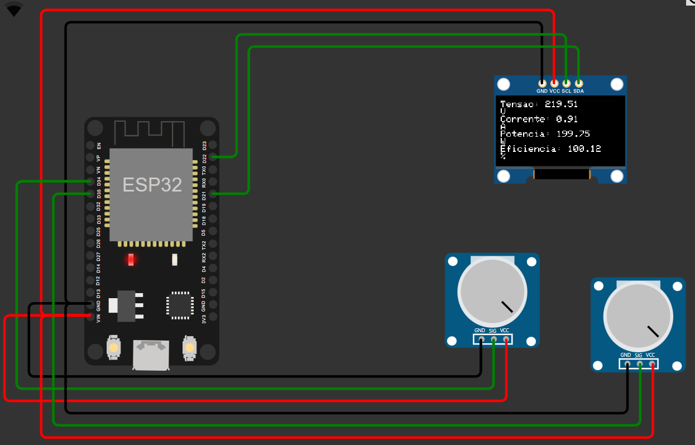
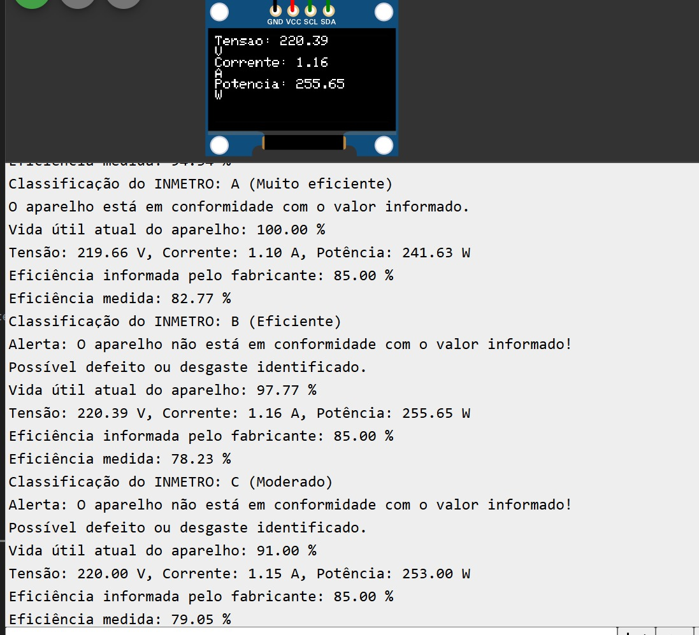
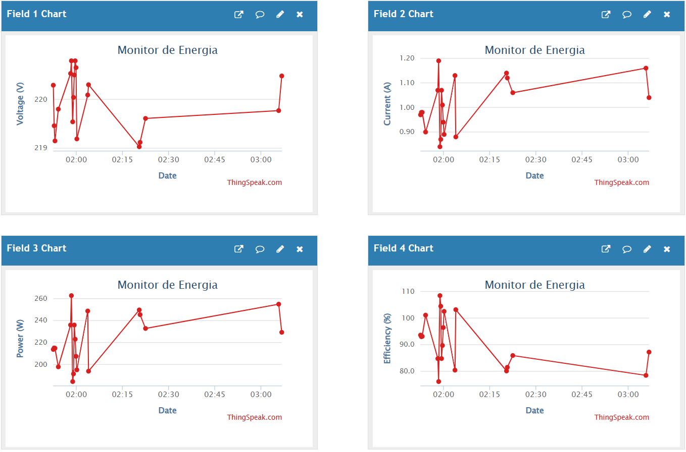

# Projeto IoT - Monitoramento Energético Inteligente

# 👨‍👨‍👧‍👧 Equipe DaVinci

- RM550341 - Allef Santos (2TDSPV)
- RM97836 - Débora Dâmaso Lopes (2TDSPN)
- RM551491 - Cassio Yuji Hirassike Sakai (2TDSPN)
- RM550323 - Paulo Barbosa Neto (2TDSPN)
- RM552314 - Yasmin Araujo Santos Lopes (2TDSPN)


## **Índice**
- [👨‍👨‍👧‍👧 Equipe DaVinci](#-equipe-davinci)
- [📚 Descrição da proposta](#-descrição-da-proposta)
- [🚀 Funcionalidades IoT](#-funcionalidades-iot)
- [🎯 Requisitos do Desafio](#-requisitos-do-desafio)
- [📝 Componentes](#-componentes)
- [✅ Funcionamento](#-funcionamento)
  - [1. Captura de Dados](#1-captura-de-dados)
  - [2. Processamento](#2-processamento)
  - [3. 📊 Visualização dos Dados](#3-visualização-dos-dados)
  - [4. 💹 Gateway](#4-gateway)
- [⚙️ Configuração](#️-configuração)
  - [1. Acesso ao circuito no Wokwi](#1-acesso-ao-circuito-no-wokwi)
  - [2. Visualização no ThingSpeak](#2-visualização-no-thingspeak)
  - [3. Configurar ThingSpeak](#3-configurar-thingspeak)
  - [4. 📽️ VÍDEO DO PROJETO](#4-📽️-VÍDEO-DO-PROJETO)

---

## 📚 Descrição da proposta

A Da Vinci Energy propõe uma solução inteligente para monitorar, controlar e otimizar o consumo de energia elétrica em residências e pequenos comércios. Utilizando dispositivos IoT, analisamos a eficiência energética de aparelhos com base na classificação do INMETRO, ajudando os usuários a:

- Detectar aparelhos ineficientes ou com possíveis defeitos, incluindo alertas.
- Reduzir o consumo e desperdício de energia, promovendo economia e sustentabilidade.
- Comparação do consumo real com o informado pelo fabricante para identificar falhas e vida útil do aparelho.


## 🚀 Funcionalidades IoT
- Monitoramento em tempo real de tensão, corrente, potência e eficiência energética.
- Exibição local no display OLED e envio de dados para a plataforma **ThingSpeak**.
- Análise de conformidade com padrões do **INMETRO**.
- Cálculo da eficiência energética com classificação (A, B, C, etc.).
- Estimativa da vida útil dos aparelhos com alertas sobre desempenho.

## 🎯 Requisitos do Desafio
| **Requisito**                                   | **Como foi atendido**                                                                                     |
|-------------------------------------------------|----------------------------------------------------------------------------------------------------------|
| **Sistema IoT com 2 dispositivos**             | Integração de dois sensores (tensão e corrente) simulados por potenciômetros.                            |
| **Hardware**                                   | Utilizamos o ESP32 como microcontrolador principal, juntamente com um display OLED para exibição local.  |
| **Dashboard**                                  | Dados enviados ao ThingSpeak, funcionando como gateway e painel de visualização em tempo real.           |
| **Gateway**                                    | Configurado com HTTP, onde o ESP32 envia os dados diretamente ao ThingSpeak.                             |
| **Protocolos**                                 | Implementação do protocolo HTTP para troca de mensagens entre o ESP32 e a plataforma.                   |
| **Desenvolvimento em simulador**               | Projeto desenvolvido no Wokwi, atendendo os requisitos de simulação e testes.                            |


## 📝 Componentes
- **ESP32**: Microcontrolador principal responsável pela coleta e processamento de dados.
- **Display OLED (128x64)**: Exibe informações locais em tempo real.
- **Potenciômetros**: Simulam os sensores de tensão e corrente. Conectados aos pinos 34 e 35.
- **Conexão Wi-Fi**: Envia os dados ao **ThingSpeak**.
- **ThingSpeak**: Plataforma utilizada como gateway e dashboard para monitorar os dados.

<p align="center">
  
</p>


## ✅ Funcionamento
### 1. Captura de Dados
- **Tensão**: Simulada por um potenciômetro conectado ao pino analógico 34.
- **Corrente**: Simulada por um potenciômetro conectado ao pino analógico 35.
- **Potência**: Calculada usando a fórmula: `P = V * I`

### 2. Processamento
O ESP32 processa os dados medidos pelos sensores, calcula a eficiência energética e verifica a conformidade com os padrões do **INMETRO**. 

O exemplo de código para essa funcionalidade é:

```cpp
// Função para calcular a eficiência real do aparelho
float calcularEficienciaReal(float consumoReal, float consumoPadrao) {
  return consumoPadrao / consumoReal;
}
```
```cpp
// Função para classificar a eficiência energética com base no INMETRO
String classificarEficiencia(float eficienciaReal) {
  if (eficienciaReal >= 0.9) {
    return "A (Muito eficiente)";
  } else if (eficienciaReal >= 0.8) {
    return "B (Eficiente)";
  } else if (eficienciaReal >= 0.7) {
    return "C (Moderado)";
  } else if (eficienciaReal >= 0.6) {
    return "D (Baixa eficiência)";
  } else {
    return "E (Ineficiente)";
  }
}
```
```cpp
// Função para avaliar a conformidade da eficiência
void avaliarConformidade(float eficienciaReal, float eficienciaInformada, String classificacao) {
  Serial.print("Eficiência informada pelo fabricante: ");
  Serial.print(eficienciaInformada * 100);
  Serial.println(" %");

  Serial.print("Eficiência medida: ");
  Serial.print(eficienciaReal * 100);
  Serial.println(" %");

  Serial.print("Classificação do INMETRO: ");
  Serial.println(classificacao);

  if (eficienciaReal >= eficienciaInformada) {
    Serial.println("O aparelho está em conformidade com o valor informado.");
  } else {
    Serial.println("Alerta: O aparelho não está em conformidade com o valor informado!");
    Serial.println("Possível defeito ou desgaste identificado.");
  }
}
```

### 3. 📊 Visualização dos Dados
1. **No Serial Monitor**:
   - Acompanhe tensão, corrente, potência, eficiência e vida útil diretamente pelo monitor serial.
2. **No Display OLED**:
   - Veja os dados processados localmente.
3. **No ThingSpeak**:
   - Acesse o canal e visualize gráficos e históricos.

<p align="center">
  
</p>


### 4. 💹 Gateway
- Os dados são enviados ao ThingSpeak via protocolo HTTP, onde podem ser visualizados em gráficos.

<p align="center">
  
</p>


## ⚙️ Configuração
### 1. Acesso ao circuito no Wokwi
É possível acessar os arquivos do circuito no diretório [Wokwi](./Wokwi) deste projeto.

Dentro dessa pasta, você encontrará os seguintes arquivos:
- Código-fonte do ESP32.
- Configurações e simulações do circuito.
- Diagramas json e outras informações relevantes.

Clique no LINK para visualizar e testar o circuito diretamente na plataforma Wokwi.: 

* [LINK da Simulação do Circuito no Wokwi](https://wokwi.com/projects/415143736305192961).


### 2. Visualização no ThingSpeak
Acompanhe os dados gerados pelo projeto diretamente pelo link abaixo:
* [LINK do canal no ThingSpeak](https://thingspeak.mathworks.com/channels/2756384).


### 3. Configurar ThingSpeak
Caso deseje, substitua `YOUR_API_KEY` pela chave de API de escrita do seu canal no ThingSpeak:
```cpp
const String apiKey = "SUA_API_KEY";
```

### 4. 📽️ VÍDEO DO PROJETO

Para visualizar o vídeo no youtube de apresentação do projeto, clique no LINK abaixo:

* [📹 LINK do vídeo no YouTube](https://www.youtube.com/playlist?list=PL1zapSlcAQTe7HdWwpb2uinI8umRt0d7Z)
